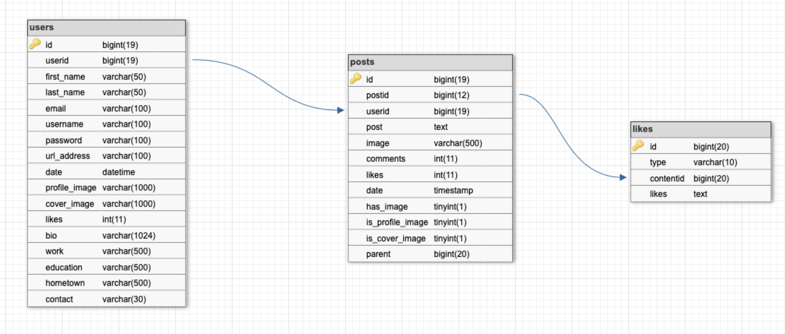
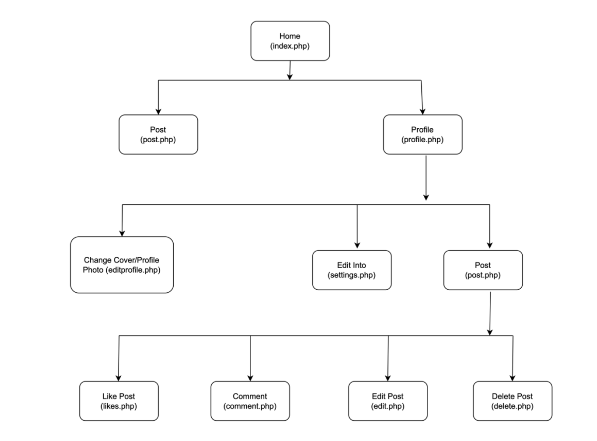

# friendzone

Friendzone is a specialised version of Facebook that allows users to build profiles, make posts, upload pictures as part of a post, and respond to other users’ comments.

Some other features of this website are -

1. Has a responsive structure that adjusts to the screen size of the device.
2. Anyone can register and use the service at any time.
3. Has a secure login method that hashes passwords before saving them to the database.
4. It allows users to navigate between pages seamlessly.
5. Reader and Poster modes are available. A reader has access to all the users' posts. A
   poster can include visuals in their message.
6. On the profile page, there is a space where the user can store a brief biography and
   contact information.
7. Each user has a page that shows all their previous posts.
8. A user can edit their own profile, which includes a brief biography and contact
   information.
9. Poster can delete their own posts.
10. All posts are time stamped with the date and time they were created.
11. All interfaces perform the same functions and display the same information.
12. All input data is validated to prevent site attacks.
13. There are a maximum of 10 posts per page. If a user wants to see more posts, they can
    use the pagination feature.
14. When registering as a new user, previously used email addresses are validated in real
    time.
15. Users can look for other users by their first, last, or full names.

Database design

Site Map

